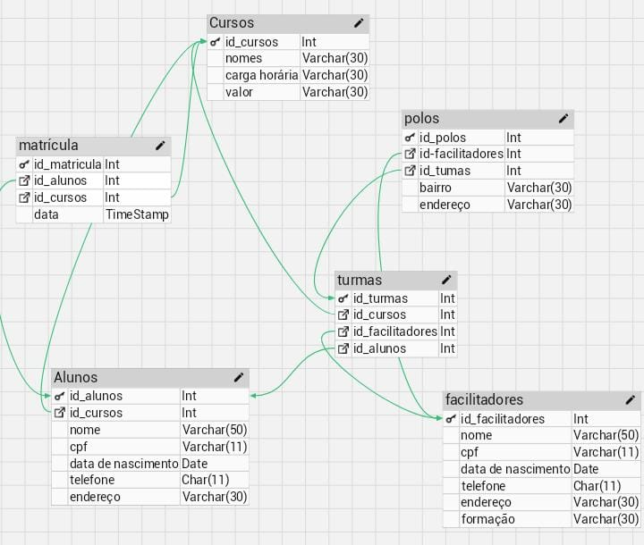

Projeto Invididual Mod 4 Resilia 

 Nesse projeto, estamos construindo um banco de dados que vai ser responsavel por amazenar o sistema de acompanhamento da Resilia, que é uma empresa do ramo de educação. 
 
 No banco de dados, <strong>as principais entidades são os Alunos,  turma e os Cursos</strong>.Com isso em mente, precisamos guardar as seguintes informações: os cursos, quantidade de turmas e dados dos alunos cadastrados no sistema.
 
<strong>As perguntas que fazemos ao elaborar o banco de dados são as seguintes:</strong>

⇨ Existem outras entidades além dessas três?
⇨ Quais são os principais campos e tipos?
⇨ Como essas entidades estão relacionadas?

<strong>Rspostas</strong>

- Sim. As entidades são dinamicas e vão surgindo de acordo com a necessidade do banco criado. 
- Cursos, alunos, facilitadores, matrículas, int, varchar, timestamp. 
- Um para muitos, muitos para muitos. 
